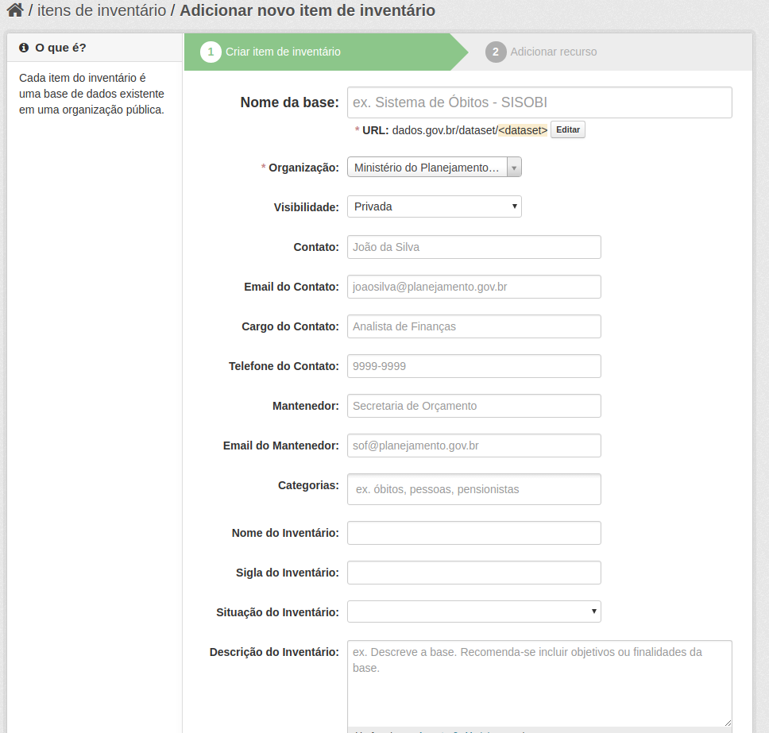

# Catalogando Inventário de bases de dados

O usuário, ao logar no portal, deverá acessar o menu [Dados](http://dados.gov.br/dataset/), para ter acesso à funcionalidade [Adicionar item de inventário](dados.gov.br/dataset/new), conforme imagem a seguir:

 

Ao clicar na funcionalidade [Adicionar item de inventário](dados.gov.br/dataset/new), o editor terá acesso aos seguintes formulários:

* Criar item de inventário
* Adicionar recurso

## Inventariando uma base de dados

No formulário __Criar item de inventário__ , o portal vai pedir o preenchimento dos seguintes metadados, conforme imagem abaixo, e em sequência, a descrição de cada campo do metadado a ser preenchido.

### Metadados da base de dados

Nome da base
:   Deve ser preenchido com nome da base ou sistema.

URL
:   Esse campo é preenchido automaticamente. Se desejar pode alterar para a sigla do sistema/base de dados.

Organização
:   O órgão ou entidade que é responsável pela base de dados. Caso seu órgão não esteja aparecendo corretamente entre em contato com <contato@dados.gov.br> para corrigir.

Visibilidade
:   Selecione pública para tornar visível para todos as informações da base de dados que está sendo inventariada.

Contato
:   Nome do contato da base de dados para esclarecimento de dúvidas acerca da base de dados. Curador responsável pela base de dados. É uma pessoa física e não o órgão. 

Email do Contato
:   Email do contato da base de dados para esclarecimento de dúvidas acerca da base de dados.

Cargo do Contato
:   Cargo na organização do contato da base de dados.

Telefone do Contato
:   Telefone do contato da base de dados para esclarecimento de dúvidas acerca da base de dados.

Mantenedor
:   Responsável técnico pela base de dados. É uma pessoa física e não o órgão.

Email do Mantenedor
:   Email corporativo da área responsável da empresa pública/órgão ou entidade que a base está hospedada.  E-mail do responsável técnico preenchido no campo __"Mantenedor"__.

Categorias
:   As Categorias são os assuntos que a base de dados trata. As categorias são separadas por vírgula.

!!! important "Atenção"
    Recomenda-se navegar e escolher as categorias do VCGE. Acesse o VCGE em <http://vocab.e.gov.br/id/governo>. Para exemplos de preenchimento veja <http://dados.gov.br/dataset/imoveis-dominiais-da-uniao>

Nome do Inventário
:   Caso o item sendo preenchido faça parte de um inventário maior por favor preencha com o nome do inventário maior. Por exemplo a base de dados ComprasNet faz parte do inventário do Sistema Integrado de Administração de Serviços Gerais.

Sigla do Inventário
:   Caso o item sendo preenchido faça parte de um inventário maior por favor preencha com a sigla do inventário maior. Por exemplo a base de dados ComprasNet faz parte do inventário do SIASG.

Situação do Inventário
:   Selecione a situação em que a base de dados ou sistema se encontra.

Descrição do inventário
:   Preencher com a descrição da base de dados do inventário. A descrição deve ser sucinta e descrevendo as formas de acesso a mesma. Recomenda-se incluir os objetivos ou finalidades da mesma.

Base possui informações sigilosas?
:   Selecione a opção de existência informações sigilosas na base de dados.

Base possui informações públicas?
:   Selecione a opção de existência informações públicas na base de dados.

Período de atualização dos dados?
:   Selecione a frequencia que é esperada a atualização dos dados da base de dados.

Observação sobre a base
:   Preencha com alguma observação revelante sobre a base de dados.

Normas legais para sigilo da Base
:   Preencha com lista de links para o LexML com as normas que embasam o sigilo da base.

Exporta para dados abertos?
:   Selecione se exporta para dados abertos ou se há previsão para tal exportação.

Unidade responsável pela base
:   Preencha com o nome por extenso da unidade responsável pela base de dados. Essa unidade é o gestor da base e não é a área de TI.

Sigla do órgão
:   Preencha com a sigla da unidade responsável pela base de dados. Essa unidade é o gestor da base e não é a área de TI.

URL da unidade responsável no SIORG 
:   URL do SIORG correspondente ao órgão responsável pela base de dados.

!!! important "Atenção"
    Para pesquisar qual a URL da organização acesse o [SIORG](https://siorg.planejamento.gov.br/siorg-cidadao-webapp/pages/listar_orgaos_estruturas/listar_orgaos_estruturas.jsf "Acesse o SIORG para encontrar a URL do seu órgão") e troque o código final pelo seu órgão. Por exemplo a URL do Advocacia Geral da União é <https://estruturaorganizacional.dados.gov.br/doc/unidade-organizacional/46>.

## Finalizando o preenchimento

Após o preenchimento dos metados deve-se clicar em __Próximo Passo__

[Topo](#topo "Ir para o topo")
